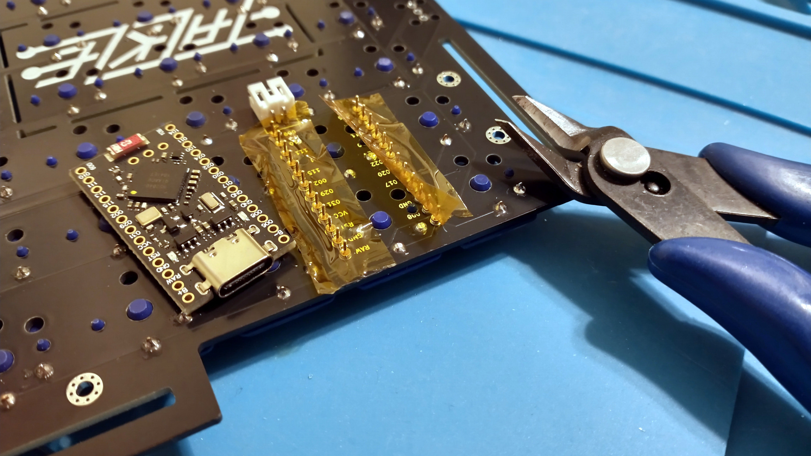

# Tackle Keyboard

Tackle is a wearable 48 key ortholinear keyboard, powered by a bluetooth-enabled Pro Micro compatible dev board.

It uses Choc v1 keyswitches with 18mm x 17mm spacing.

Tackle is strapped to your torso so you can type anywhere your hands are free.

## Project structure

* [`gerbers`](gerbers): Gerber files for PCB manufacturing
* [`graphics`](graphics): Source assets for PCB silkscreen
* [`kicad`](kicad): KiCad project files (schematics and PCB designs)
* [`kicad-libraries`](kicad-libraries): KiCad components and footprints
* [`images`](images): Images for project documentation

## PCBs

**Each build uses FIVE copies of the same PCB.**

One PCB is used as the logical PCB. All components are soldered on to this board.

Three PCBs are used as center plates to encase the microcontroller dev board and battery. Note breakout sections of these PCBs must be cut out.

A final PCB is used as the bottom plate. All the PCBs are screwed directly together.

## Keyboard firmware

* ZMK
    * Tackle shield definition is in [skarrmann's zmk-config](https://github.com/skarrmann/zmk-config)

## Bill of materials

Part | Purpose | Quantity | Notes
---- | ------- | -------- | ---------
Main PCB  | logical PCB, case plates | 5 | Send Gerber zip files to [JLCPCB](https://jlcpcb.com/)
Bluetooth Pro Micro | Microcontroller board | 1 | nice!nano or SuperMini nRF52840
303450 LiPo Battery | Powers the wireless keyboard | 1 | JST PH 2.0 connector
S2B-PH-K-S connector | JST PH 2.0 battery connector | 1 |
SS12D00 | On/Off switch | 1 | Can also use E-Switch EG1218
6mm x 6mm push button | Reset button | 1 |
1N4148 SOD-123 | Diodes for keyboard row-column matrix | 48 |
Choc v1 Keyswitches |  | 48 |
Choc v1 Keycaps |  | 48 | Use keycaps which fit 18mm x 17mm spacing
M2 10mm screws | Screws PCBs together | 10 |
M2 nuts | Holds the top screws between the PCBs | 10 |
[Peel-a-way Sockets and Pins](https://ringerkeys.com/collections/modders-tools/products/peel-a-way-sockets) | Sockets the dev board to PCB | 2 strips of 12 pins/sockets | May use other low profile sockets which give no more than ~4.5 mm total height.
40mm/1.5" nylon strapping, buckles, and slide clips set | Straps the keyboard to your torso | 1 | [Example nylon webbing set](https://www.amazon.com/dp/B09FFKCLD7?ref=ppx_yo2ov_dt_b_fed_asin_title)

## PCB manufacturing settings

These are the manufacturing settings I used when ordering from JLCPCB:

* **Base Material**: FR4
* **Layers**: 2
* **Dimensions**: (whatever the gerber file specifies)
* **PCB Qty**: 5
* **Different Design**: 1
* **Delivery Format**: Single PCB
* **PCB Thickness**: 1.6
* **PCB Color**: Black
* **Silkscreen**: White
* **Surface Finish**: LeadFree HASL-RoHS
* **Outer Copper Weight**: 1 oz
* **Gold Fingers**: No
* **Confirm Production File**: No
* **Flying Probe Test**: Fully Test
* **Castellated Holes**: No
* **Mark on PCB**: Remove Mark

## Build tips

* Before starting, check if the PCBs are warped, and bend them to be perfectly flat before soldering.
* First, cut the battery and dev board sections out of the three center plate PCBs. I used a 10" mini hacksaw. **CUT PCBs OUTSIDE WHILE WEARING A MASK. PCB DUST IS HAZARDOUS FOR YOUR LUNGS.**
    * 
    * 
* Next, solder the dev board sockets, diodes, and battery connector. Make sure the diodes are oriented correctly, cathode on the side with the line! After the keyswitches are soldered in, you won't be able to get to the diodes anymore.
    * 
    * 
    * 
* Then solder the keyswitches.
    * 
* After soldering the keyswitches, use flush cutters to clip down the metal pins on the two keyswitches underneath the dev board. Make sure the dev board is placed **components side up**. The pinout labels printed on the PCB should align with those printed on the dev board. 
    * 
* Then solder the power switch and reset button.
    * 
* Line up the three center plate PCBs. Place the battery in the center hole, and route the battery wires in the empty space near the battery connector. **MAKE SURE THE BLACK WIRE LINES UP WITH THE (-), AND THE RED WIRE LINES UP WITH THE (+), OR YOU'LL FRY YOUR DEV BOARD!**
    * 
* Line up the bottom plate PCB. Put the M2 screws through the bottom of the PCBs, and secure them at the top of the PCBs with an M2 nut.
    * 
    * 

## Revision history

* Tackle 1.1 (2024-12-13)
    * Widen breakout lines for dev board and battery, to make sawing PCBs easier
* Tackle 1.0 (2024-11-28)
    * Initial Choc switch PCB design